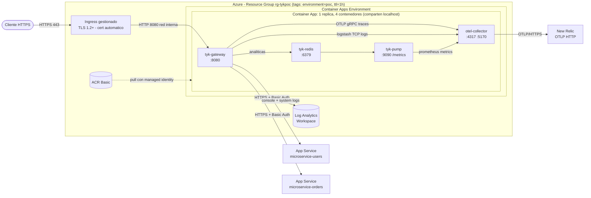

# PoC Tyk OSS API Gateway en Azure Container Apps

PoC de API Gateway con **Tyk Gateway OSS** (100% Community Edition) desplegado en **Azure
Container Apps**, con TLS obligatorio, observabilidad completa hacia **New Relic** vía
OpenTelemetry y trazabilidad de plataforma en **Azure Monitor**.

Diseñado para vivir aproximadamente **una hora** y destruirse por completo: coste mínimo,
cero credenciales en el repositorio y despliegue reproducible desde cero por pipeline.

> **Este repositorio se despliega EL ÚLTIMO.** El gateway no publica APIs propias: solo
> enruta hacia `microservice-users` y `microservice-orders`, y necesita su URL y sus
> credenciales **antes** de arrancar. Si lo despliegas primero, el pipeline falla en el
> primer paso. Ver [orden de despliegue del PoC](#0-orden-de-despliegue-del-poc).

> **Antes de empezar:** lee [`docs/analysis-inventory.md`](docs/analysis-inventory.md). Contiene
> el inventario de credenciales que estaban embebidas en versiones anteriores de este
> repositorio y las acciones de rotación que siguen pendientes por parte del propietario.
> Describe una arquitectura anterior basada en VM, ya sustituida por Container Apps, así que
> léelo como registro histórico y no como la arquitectura actual.

---

## 0. Orden de despliegue del PoC

El PoC son **tres repositorios** con dependencias en cadena, y el orden no es opcional:

```
1. poc-microservice-users      (no depende de nadie)
        ↓  su URL
2. poc-microservice-orders     (primer despliegue, SIN GATEWAY_BASE_URL)
        ↓  las URLs de los dos
3. poc-tyk-api-gateway         (este repositorio)
        ↓  el FQDN del gateway
4. poc-microservice-orders     (segundo despliegue, ya con GATEWAY_BASE_URL)
```

**Por qué orders se despliega dos veces.** Orders valida cada pedido contra users **a través de
este gateway**, no directamente. Eso cierra un ciclo: el gateway necesita la URL de orders para
enrutar hacia él, y orders necesita la URL del gateway para llamar a users. Se rompe dejando que
orders arranque sin la URL del gateway en el paso 2: se despliega, y sus endpoints de pedidos
devuelven `503` hasta el paso 4. Su pipeline lo avisa con un warning en lugar de fallar.

Consecuencia para este repositorio: **orders es a la vez upstream y consumidor**. Como upstream lo
alcanzas por `UPSTREAM_ORDERS_*`; como consumidor usa las credenciales
`USERNAME_API_USERS` / `PASSWORD_API_USERS`, las mismas que cualquier otro cliente de
`/api-users/v1`.

### Qué tienes que tener antes de lanzar este pipeline

| Necesitas | De dónde sale | Dónde se pone aquí |
|-----------|---------------|--------------------|
| URL de users | Salida del deploy de `poc-microservice-users` | Variable `UPSTREAM_USERS_TARGET_URL` |
| Credenciales de users | Secrets `BASIC_AUTH_USER` / `BASIC_AUTH_PASSWORD` de ese repositorio | Secrets `UPSTREAM_USERS_BASIC_USER` / `UPSTREAM_USERS_BASIC_PASSWORD` |
| URL de orders | Salida del deploy de `poc-microservice-orders` | Variable `UPSTREAM_ORDERS_TARGET_URL` |
| Credenciales de orders | Secrets `BASIC_AUTH_USER` / `BASIC_AUTH_PASSWORD` de ese repositorio | Secrets `UPSTREAM_ORDERS_BASIC_USER` / `UPSTREAM_ORDERS_BASIC_PASSWORD` |

Las credenciales tienen que **coincidir exactamente**: son las que los microservicios exigen a
quien les llama. Si no coinciden, el gateway responde `200` en su health check pero devuelve
`401` en cada llamada real, porque el fallo está en el salto hacia el upstream.

### Cómo sacar las dos URLs

> **Esto lo ejecutas tú, en tu terminal.** El pipeline **no** descubre las URLs: las lee de las
> variables de repositorio `UPSTREAM_USERS_TARGET_URL` y `UPSTREAM_ORDERS_TARGET_URL`, que tienes
> que rellenar a mano, y falla en el primer paso si están vacías. Los comandos de abajo son solo
> un atajo para no ir al portal a buscar la URL: copias el resultado y lo pegas en la variable.
> Automatizarlo es posible y está diseñado en la
> [sección 12](#12-automatizar-el-descubrimiento-de-los-upstreams), pero **hoy no está hecho**.

Como los nombres de los recursos son deterministas, las URLs se pueden resolver por etiqueta:

```bash
USERS_URL="https://$(az webapp list \
  --query "[?tags.project=='poc-microservice-users' && tags.environment=='poc'].defaultHostName | [0]" -o tsv)"
ORDERS_URL="https://$(az webapp list \
  --query "[?tags.project=='poc-microservice-orders' && tags.environment=='poc'].defaultHostName | [0]" -o tsv)"

echo "UPSTREAM_USERS_TARGET_URL  = $USERS_URL"
echo "UPSTREAM_ORDERS_TARGET_URL = $ORDERS_URL"
```

Si alguno sale vacío, ese microservicio no está desplegado y **no sigas**: crea primero su
resource group con su propio pipeline.

Ninguna URL debe terminar en `/`: el gateway concatena la ruta y una barra final produce
peticiones con doble barra que el upstream rechaza.

### Comprobar que los upstreams responden antes de desplegar

```bash
curl -s -o /dev/null -w "users  %{http_code}\n" \
  -u "$UPSTREAM_USERS_BASIC_USER:$UPSTREAM_USERS_BASIC_PASSWORD" "$USERS_URL/users"
curl -s -o /dev/null -w "orders %{http_code}\n" \
  -u "$UPSTREAM_ORDERS_BASIC_USER:$UPSTREAM_ORDERS_BASIC_PASSWORD" "$ORDERS_URL/status"
```

Los dos tienen que dar `200`. Un `401` significa que las credenciales no son las que espera el
microservicio; un `000` o un timeout, que la URL no es la buena.

### De dónde sale cada dato, hoy

La única fuente de verdad del gateway son **sus propias variables y secrets de repositorio**.
Nada se deriva ni se consulta en tiempo de despliegue, así que esta información vive duplicada:

| En este repositorio | Es una copia de | Cambia si... |
|---------------------|-----------------|--------------|
| Variable `UPSTREAM_USERS_TARGET_URL` | La URL de la Web App de users | Cambian el resource group, el `POC_NAME_PREFIX` o la suscripción de ese repo |
| Variable `UPSTREAM_ORDERS_TARGET_URL` | La URL de la Web App de orders | Lo mismo, en el repo de orders |
| Secrets `UPSTREAM_USERS_BASIC_*` | Secrets `BASIC_AUTH_*` de users | Cada rotación de esa credencial |
| Secrets `UPSTREAM_ORDERS_BASIC_*` | Secrets `API_*` de orders | Cada rotación de esa credencial |
| Secret `NR_LICENSE_KEY` | El mismo ingest key en los tres repos | Cada rotación de la key |
| Variables `SERVICE_NAMESPACE`, `ENVIRONMENT`, `NR_OTLP_ENDPOINT` | Los mismos valores en los tres repos | Deben coincidir o la correlación en New Relic se rompe |

Las URLs son estables: los nombres se derivan de `uniqueString(resourceGroup().id)`, que es
determinista, así que la URL que pegues una vez sigue valiendo en cada redespliegue. Lo que sí
duele es la rotación de credenciales, que hay que hacer en dos repositorios a la vez y en el
orden correcto, y el alta inicial.

Ver [12. Automatizar el descubrimiento de los upstreams](#12-automatizar-el-descubrimiento-de-los-upstreams).

---

## 1. Arquitectura

### 1.1 Vista de despliegue en Azure



### 1.2 Flujo de senales de observabilidad

```
                      +-------------------+
  trazas OTLP gRPC -->|                   |
  (tyk-gateway)       |                   |
                      |  OTel Collector   |--- OTLP/HTTPS ---> New Relic
  logs logstash TCP ->|  (sidecar)        |                    (traces, logs,
  (tyk-gateway)       |                   |                     metrics)
                      |                   |
  metricas prometheus>|                   |
  (tyk-pump :9090)    +-------------------+
                              ^
                              |
                        redis receiver
                        (tyk-redis:6379)

  Plataforma Azure:
  Container Apps  --- console/system logs ---> Log Analytics Workspace
  Subscription    --- Activity Log ----------> Log Analytics Workspace
```

### 1.3 Componentes

| Componente | Imagen | Rol | Licencia |
|------------|--------|-----|----------|
| `tyk-gateway` | `docker.tyk.io/tyk-gateway/tyk-gateway` + config propia | API Gateway, autenticación Basic Auth, rate limiting, trazas OTLP | OSS (MPL-2.0) |
| `tyk-redis` | `redis:7.2-alpine` | Almacén de keys y de registros de analítica | OSS |
| `tyk-pump` | `tykio/tyk-pump-docker-pub` + config propia | Vacía las analíticas de Redis y las expone como métricas Prometheus | OSS |
| `otel-collector` | `otel/opentelemetry-collector-contrib` + config propia | Recibe trazas, logs y métricas y las exporta a New Relic | OSS |

**No se usa Tyk Dashboard** (no es OSS). Las definiciones de API son ficheros
(`policy_source: file`, `use_db_app_configs: false`), por lo que no hace falta MongoDB ni
PostgreSQL.

---

## 2. Estructura del repositorio

```
.
├── .github/workflows/
│   ├── deploy.yml            Build + despliegue + smoke tests + auto-limpieza
├── docker/
│   ├── gateway.Dockerfile    Imagen del gateway con las plantillas de API
│   ├── gateway-entrypoint.sh Renderiza las definiciones de API desde variables de entorno
│   ├── pump.Dockerfile       Imagen de Tyk Pump
│   └── otel.Dockerfile       Imagen del colector con la pipeline embebida
├── docs/
│   └── analysis-inventory.md Inventario de credenciales y plan de migración (Fase 1)
├── infra/
│   ├── main.bicep            Etapa 1: RG, Log Analytics, ACR, identidad, CAE
│   ├── main.bicepparam
│   ├── app.bicep             Etapa 2: Container App con los 4 contenedores
│   ├── app.bicepparam
│   └── modules/foundation.bicep
├── otel/config.yaml          Pipeline del colector (traces, logs, metrics)
├── scripts/
│   └── generate-local-certs.sh
├── tyk/
│   ├── tyk.conf              Sin secretos: se rellenan por TYK_GW_*
│   ├── apps/*.json.tpl       Plantillas de definición de API
│   ├── policies/policies.json
│   └── pump/pump.conf
├── docker-compose.yaml       Stack local
├── provision_key.sh          Alta de keys de consumidor
├── run-gateway.sh            Arranque local completo
└── execute-massive-requets.sh Generador de tráfico
```

---

## 3. Variables de entorno

Copia `.env.example` a `.env` y sustituye todos los `CHANGE_ME`. **`.env` está en
`.gitignore` y nunca debe commitearse.**

### 3.1 Identidad del despliegue

| Variable | Descripción | Valor por defecto |
|----------|-------------|-------------------|
| `COMPOSE_PROJECT_NAME` | Nombre del proyecto de Docker Compose | `tyk-otel-newrelic` |
| `ENVIRONMENT` | Atributo `deployment.environment` en New Relic | `local` |
| `SERVICE_NAMESPACE` | Atributo `service.namespace` en New Relic | `poc-observability` |

### 3.2 New Relic

| Variable | Descripción | Valor por defecto |
|----------|-------------|-------------------|
| `NR_LICENSE_KEY` | **Secreto.** License key de ingesta de New Relic | obligatorio |
| `NR_OTLP_ENDPOINT` | Endpoint OTLP. EU: `https://otlp.eu01.nr-data.net:4318`, US: `https://otlp.nr-data.net:4318` | `https://otlp.eu01.nr-data.net:4318` |

### 3.3 OpenTelemetry Collector

| Variable | Descripción | Valor por defecto |
|----------|-------------|-------------------|
| `OTEL_VERSION` | Versión de la imagen contrib del colector | `0.100.0` |
| `OTEL_TELEMETRY_LOG_LEVEL` | Verbosidad del propio colector | `info` |
| `REDIS_ENDPOINT` | `host:puerto` de Redis para el receiver de métricas | `tyk-redis:6379` |
| `TYK_PUMP_METRICS_ENDPOINT` | `host:puerto` del pump Prometheus | `tyk-pump:9090` |

### 3.4 Redis

| Variable | Descripción | Valor por defecto |
|----------|-------------|-------------------|
| `REDIS_HOST` | Host de Redis visto por el gateway y el pump | `tyk-redis` |
| `REDIS_INTERNAL_PORT` | Puerto de Redis dentro de la red de contenedores | `6379` |
| `REDIS_PORT` | Puerto publicado en `127.0.0.1` del host (solo diagnóstico) | `6379` |

### 3.5 Tyk Gateway

| Variable | Descripción | Valor por defecto |
|----------|-------------|-------------------|
| `TYK_VERSION` | Versión de la imagen del gateway | `v5.12.0` |
| `TYK_GATEWAY_IMAGE` / `TYK_PUMP_IMAGE` | Tags locales de las imágenes construidas | `poc-tyk-*:local` |
| `TYK_SECRET` | **Secreto.** Admin secret de la API de gestión (`x-tyk-authorization`) | obligatorio |
| `TYK_NODE_SECRET` | **Secreto.** Node secret del gateway | obligatorio |
| `TYK_PORT` | Puerto publicado en el host local | `8443` |
| `TYK_LISTEN_PORT` | Puerto de escucha dentro del contenedor | `8080` |
| `TYK_HTTP_USE_SSL` | El gateway termina TLS. `true` en local, `false` en Azure | `true` |
| `TYK_ORG_ID` | `org_id` de las definiciones de API y de las keys | `poc-organization` |

### 3.6 Logging y analítica del gateway

| Variable | Descripción | Valor por defecto |
|----------|-------------|-------------------|
| `TYK_LOG_LEVEL` | `debug` \| `info` \| `warn` \| `error` | `info` |
| `TYK_GW_LOGFORMAT` | Formato de log. `json` es imprescindible para el parseo del colector | `json` |
| `TYK_GW_ACCESSLOGS_ENABLED` | Access log por petición (base de la traza de auditoría) | `true` |
| `TYK_GW_ACCESSLOGS_TEMPLATE` | Campos incluidos en el access log | ver `.env.example` |
| `TYK_GW_TRACK404LOGS` | Registrar los 404 | `false` |
| `TYK_ENABLE_ANALYTICS` | Generación de registros de analítica para el pump | `true` |
| `TYK_ENABLE_DETAILED_RECORDING` | Guarda cuerpos completos de petición y respuesta en Redis. **Riesgo de PII** | `false` |
| `TYK_GW_USE_LOGSTASH` | Envío de logs por TCP al colector. `false` en local, `true` en Azure | `false` |
| `TYK_GW_LOGSTASH_TRANSPORT` | Transporte del envío de logs | `tcp` |
| `TYK_GW_LOGSTASH_ADDR` | Destino del envío de logs | `otel-collector:5170` |

### 3.7 Trazas del gateway

| Variable | Descripción | Valor por defecto |
|----------|-------------|-------------------|
| `TYK_GW_OTEL_ENABLED` | Activa o desactiva la emisión de trazas | `true` |
| `TYK_GW_OTEL_EXPORTER` | Exportador OTLP | `grpc` |
| `TYK_GW_OTEL_ENDPOINT` | Endpoint del colector | `otel-collector:4317` |
| `TYK_GW_OTEL_RESOURCE_NAME` | `service.name` de las trazas | `tyk-gateway` |
| `TYK_GW_OTEL_CONTEXT_PROPAGATION` | Propagación de contexto | `tracecontext` |
| `TYK_GW_OTEL_CONNECTION_TIMEOUT` | Timeout de conexión en segundos | `10` |
| `TYK_GW_OTEL_CUSTOM_TRACE_HEADERS` | Cabeceras adicionales propagadas | lista B3 + W3C |
| `TYK_DETAILED_TRACING` | Spans detallados por API | `true` |

### 3.8 Tyk Pump

| Variable | Descripción | Valor por defecto |
|----------|-------------|-------------------|
| `TYK_PUMP_VERSION` | Versión de la imagen del pump | `v1.12.0` |
| `TYK_PUMP_PURGE_DELAY` | Segundos entre vaciados de Redis | `10` |
| `TYK_PUMP_LOG_LEVEL` | Nivel de log del pump | `info` |

### 3.9 Upstreams (Basic Auth hacia el backend)

Se inyectan en las definiciones de API en el arranque del contenedor. **Nunca tocan un
fichero versionado.**

| Variable | Descripción | Debe coincidir con |
|----------|-------------|--------------------|
| `UPSTREAM_USERS_TARGET_URL` | URL del microservicio de usuarios, sin barra final | La Web App de `poc-microservice-users` |
| `UPSTREAM_USERS_BASIC_USER` | **Secreto.** Usuario Basic Auth del upstream de usuarios | `BASIC_AUTH_USER` en `poc-microservice-users` |
| `UPSTREAM_USERS_BASIC_PASSWORD` | **Secreto.** Contraseña del upstream de usuarios | `BASIC_AUTH_PASSWORD` en `poc-microservice-users` |
| `UPSTREAM_ORDERS_TARGET_URL` | URL del microservicio de pedidos, sin barra final | La Web App de `poc-microservice-orders` |
| `UPSTREAM_ORDERS_BASIC_USER` | **Secreto.** Usuario Basic Auth del upstream de pedidos | `BASIC_AUTH_USER` en `poc-microservice-orders` |
| `UPSTREAM_ORDERS_BASIC_PASSWORD` | **Secreto.** Contraseña del upstream de pedidos | `BASIC_AUTH_PASSWORD` en `poc-microservice-orders` |

Los dos microservicios tienen que estar desplegados antes: ver
[orden de despliegue del PoC](#0-orden-de-despliegue-del-poc).

### 3.10 Consumidores (Basic Auth hacia el gateway)

Credenciales que presentan los clientes al gateway. Las crea `provision_key.sh`. **No
reutilices aquí las credenciales del upstream.**

| Variable | Descripción |
|----------|-------------|
| `USERNAME_API_USERS` / `PASSWORD_API_USERS` | **Secreto.** Consumidor de `/api-users/v1` |
| `USERNAME_API_ORDERS` / `PASSWORD_API_ORDERS` | **Secreto.** Consumidor de `/api-orders/v1` |

### 3.11 Scripts locales

| Variable | Descripción | Valor por defecto |
|----------|-------------|-------------------|
| `GATEWAY_BASE_URL` | URL base usada por los scripts | `https://localhost:8443` |
| `GATEWAY_ALLOW_INSECURE_TLS` | Desactiva la validación TLS. **Solo para el certificado autofirmado local** | `true` |
| `LOCAL_CERT_CN` | CN del certificado local generado | `localhost` |

---

## 4. Despliegue local (docker-compose)

### Prerrequisitos

| Herramienta | Versión mínima |
|-------------|----------------|
| Docker Engine | 24+ |
| Docker Compose | 2.20+ |
| `openssl`, `curl`, `bash` | cualquiera reciente |

### Pasos

```bash
cp .env.example .env

# Genera secretos fuertes para el gateway
openssl rand -hex 32   # -> TYK_SECRET
openssl rand -hex 32   # -> TYK_NODE_SECRET

# Edita .env y rellena los CHANGE_ME (New Relic, upstreams, consumidores)

chmod +x run-gateway.sh provision_key.sh execute-massive-requets.sh scripts/*.sh
./run-gateway.sh
```

`run-gateway.sh` genera el certificado autofirmado local, construye las imágenes, levanta el
stack, espera a que el gateway responda y provisiona las keys de consumidor.

### Comprobación

```bash
# Salud del gateway (certificado autofirmado: -k es aceptable solo en local)
curl -k https://localhost:8443/hello

# Llamada autenticada
curl -k -u "$USERNAME_API_USERS:$PASSWORD_API_USERS" https://localhost:8443/api-users/v1/

# Generar tráfico para ver datos en New Relic
./execute-massive-requets.sh 50 users
```

Puertos publicados en local, todos ligados a `127.0.0.1`:

| Puerto | Servicio |
|--------|----------|
| `8443` | Gateway (HTTPS) |
| `13133` | Health check del colector |
| `8888` | Métricas internas del colector |
| `24224` | Fluent Forward (driver de logs de Docker) |
| `6379` | Redis (solo diagnóstico) |

---

## 5. Despliegue en Azure

### 5.1 Decisión de infraestructura: Azure Container Apps

Se evaluaron tres opciones. La elegida es **Azure Container Apps (plan Consumo)**.

| Criterio | Container Apps | Container Instances (ACI) | VM / VMSS (estado anterior) |
|----------|----------------|---------------------------|------------------------------|
| TLS en el endpoint público | **Incluido**: ingress gestionado con certificado automático para el FQDN `*.azurecontainerapps.io` | No nativo. Requiere sidecar Caddy/nginx con dominio propio y ACME, o Application Gateway / Front Door | Requiere Traefik o similar dentro de la VM y un dominio propio |
| Coste adicional para TLS | 0 EUR | Application Gateway desde ~0,20 EUR/h, o complejidad de ACME | Certificado y operación manual |
| Facturación | Por consumo de vCPU-s y GiB-s, con franquicia mensual gratuita | Por segundo, sin franquicia | Por hora encendida, más discos e IP incluso apagada |
| Multicontenedor | Sí, sidecars sobre `localhost` | Sí, container group | Sí, docker compose |
| Escala a cero | Sí (`minReplicas: 0`) | No | No |
| Reproducibilidad por pipeline | Total | Total | Baja: requiere SSH y pasos manuales |
| Tiempo de despliegue | ~4-6 minutos | ~2 minutos | ~8-12 minutos más provisión manual |

**Se descarta VM/VMSS explícitamente**: una `Standard_B2s` factura de forma continua aunque no
reciba tráfico, y el disco gestionado y la IP pública estática siguen facturando incluso con
la VM apagada. Para un PoC de una hora es el peor perfil de coste y además exige pasos
manuales que rompen la idempotencia.

**Se descarta ACI** porque el requisito de TLS obligatorio obliga a añadir un terminador
(Application Gateway o Front Door) cuyo coste por hora supera al de todo el resto del PoC
junto, o a gestionar un dominio propio con ACME, lo que añade dependencias externas.

**IaC: Bicep, no Terraform.** Razones: no necesita backend remoto de estado (un PoC efímero
con estado remoto añade un recurso más que limpiar), el repositorio ya venía con Bicep, el
soporte de tipos de recurso nuevos de Azure llega antes, y `az deployment` es idempotente sin
infraestructura adicional. Terraform sería preferible si el PoC tuviese que ser multicloud o
convivir con módulos existentes.

**Escala a cero:** el PoC despliega con `minReplicas = 1`. Redis se ejecuta como sidecar y su
contenido (keys de consumidor y analíticas pendientes de volcar) es efímero: al escalar a cero
se perderían las keys provisionadas. Para escenarios que sí quieran escala a cero, hay que
sustituir el sidecar por Azure Cache for Redis y poner `minReplicas = 0`.

### 5.2 Recursos creados

| Recurso | Nombre | SKU / configuración |
|---------|--------|---------------------|
| Resource Group | `rg-tykpoc` | tags `environment=poc`, `ttl=1h`, `owner`, `project`, `createdAt` |
| Log Analytics Workspace | `log-tykpoc` | PerGB2018, retención 30 días, cuota diaria 1 GB |
| Container Registry | `acrtykpoc<hash>` | **Basic**, admin user deshabilitado, pull anónimo deshabilitado |
| Managed Identity | `id-tykpoc` | User assigned, con rol `AcrPull` sobre el ACR |
| Container Apps Environment | `cae-tykpoc` | Logs de consola y de sistema hacia Log Analytics. Solo lleva `newrelicLogs=exclude` si `NR_EXCLUDE_PLATFORM_LOGS=true`, que **no** es el valor por defecto |
| Container App | `ca-tykpoc-gw` | 1 réplica, 4 contenedores, 1,5 vCPU y 3 GiB en total. Misma condición para la etiqueta |
| Diagnostic Settings | `diag-cae-tykpoc` | `allLogs` + `AllMetrics` del entorno hacia Log Analytics |
| Diagnostic Settings | `diag-acr-tykpoc` | `allLogs` + `AllMetrics` del registro: quién hizo login, push y pull de cada imagen |
| Diagnostic Settings (suscripción) | `diag-activitylog-tykpoc` | Activity Log (Administrative, Security, Policy, ResourceHealth) |

### 5.3 Configuración previa del pipeline

**1. Aplicación de Entra ID con credenciales federadas (OIDC).** No se usa ningún client
secret.

```bash
# Crear la aplicación y el service principal
appId=$(az ad app create --display-name "gh-poc-tyk-api-gateway" --query appId -o tsv)
az ad sp create --id "$appId"

# Credencial federada para la rama main
az ad app federated-credential create --id "$appId" --parameters '{
  "name": "gh-main",
  "issuer": "https://token.actions.githubusercontent.com",
  "subject": "repo:<ORG>/<REPO>:ref:refs/heads/main",
  "audiences": ["api://AzureADTokenExchange"]
}'

# Credencial federada para ejecuciones manuales del workflow
az ad app federated-credential create --id "$appId" --parameters '{
  "name": "gh-dispatch",
  "issuer": "https://token.actions.githubusercontent.com",
  "subject": "repo:<ORG>/<REPO>:ref:refs/heads/main",
  "audiences": ["api://AzureADTokenExchange"]
}'

# Permisos: Contributor para crear los recursos y RBAC Administrator para
# asignar AcrPull a la identidad gestionada.
subId=$(az account show --query id -o tsv)
spId=$(az ad sp show --id "$appId" --query id -o tsv)
az role assignment create --assignee-object-id "$spId" --assignee-principal-type ServicePrincipal \
  --role "Contributor" --scope "/subscriptions/$subId"
az role assignment create --assignee-object-id "$spId" --assignee-principal-type ServicePrincipal \
  --role "Role Based Access Control Administrator" --scope "/subscriptions/$subId"
```

Si no es posible conceder el rol de administración de RBAC, pon la variable de repositorio
`ASSIGN_ACR_PULL_ROLE=false` y asigna `AcrPull` a la identidad `id-tykpoc` manualmente.

**2. GitHub Secrets** (Settings > Secrets and variables > Actions > Secrets):

| Secret | Contenido |
|--------|-----------|
| `AZURE_CLIENT_ID` | `appId` de la aplicación de Entra ID |
| `AZURE_TENANT_ID` | Tenant de Entra ID |
| `AZURE_SUBSCRIPTION_ID` | Suscripción de destino |
| `TYK_SECRET` | Admin secret del gateway (`openssl rand -hex 32`) |
| `TYK_NODE_SECRET` | Node secret del gateway (`openssl rand -hex 32`) |
| `NR_LICENSE_KEY` | License key de ingesta de New Relic |
| `UPSTREAM_USERS_BASIC_USER` / `UPSTREAM_USERS_BASIC_PASSWORD` | Credenciales del upstream de usuarios |
| `UPSTREAM_ORDERS_BASIC_USER` / `UPSTREAM_ORDERS_BASIC_PASSWORD` | Credenciales del upstream de pedidos |
| `USERNAME_API_USERS` / `PASSWORD_API_USERS` | Consumidor de `/api-users/v1` |
| `USERNAME_API_ORDERS` / `PASSWORD_API_ORDERS` | Consumidor de `/api-orders/v1` |

**3. GitHub Variables** (no sensibles):

| Variable | Descripción | Valor por defecto si no se define |
|----------|-------------|-----------------------------------|
| `AZURE_LOCATION` | Región | `westeurope` |
| `AZURE_RESOURCE_GROUP` | Resource group del PoC | `rg-tykpoc` |
| `POC_NAME_PREFIX` | Prefijo de nombres (3-12 caracteres) | `tykpoc` |
| `POC_OWNER` | Tag `owner` | `unknown` |
| `POC_TTL` | Tag `ttl` | `1h` |
| `UPSTREAM_USERS_TARGET_URL` | URL del upstream de usuarios | **obligatoria** |
| `UPSTREAM_ORDERS_TARGET_URL` | URL del upstream de pedidos | **obligatoria** |
| `NR_OTLP_ENDPOINT` | Endpoint OTLP de New Relic | `https://otlp.eu01.nr-data.net:4318` |
| `LOG_RETENTION_DAYS` | Retención de Log Analytics | `30` |
| `LOG_DAILY_QUOTA_GB` | Tope diario de ingesta | `1` |
| `ENABLE_ACTIVITY_LOG_EXPORT` | Exportar el Activity Log de la suscripción al workspace. Es el único de los tres repositorios que lo trae en `true`: el Activity Log es de suscripción y solo debe exportarlo uno | `true` |
| `ENABLE_LOG_ANALYTICS` | Crear los Diagnostic Settings hacia Log Analytics. Ponlo a `false` cuando el servicio nativo de New Relic ya reenvíe los logs de plataforma, para no ingerir el mismo dato dos veces. Con `false`, los logs de consola tampoco se copian al workspace | `true` |
| `NR_EXCLUDE_PLATFORM_LOGS` | Etiqueta el Container Apps Environment con `newrelicLogs=exclude`. **Déjalo en `false`** salvo que veas las líneas del gateway duplicadas: la exclusión aplica a todo el entorno y silenciaría también a Redis, al pump y al colector, que no tienen otra vía hacia New Relic | `false` |
| `TYK_DETAILED_TRACING` | Un span por middleware de Tyk. Muestra dónde se va el tiempo **dentro** del gateway, a cambio de multiplicar el volumen de spans. Antes estaba fijado en el Bicep y no se podía apagar desde el pipeline | `true` |
| `SERVICE_VERSION` | `service.version` de la telemetría del gateway. Toma el valor de `TYK_VERSION`, así se sabe qué versión del gateway produjo cada traza | valor de `TYK_VERSION` |
| `ASSIGN_ACR_PULL_ROLE` | Asignar `AcrPull` desde Bicep | `true` |
| `GATEWAY_USE_LOGSTASH` | Envío de logs del gateway al colector por TCP | `true` |
| `TYK_ENABLE_DETAILED_RECORDING` | Guardar cuerpos completos en Redis. **Riesgo de PII** | `false` |
| `TYK_LOG_LEVEL` | Nivel de log del gateway y del pump | `info` |
| `TYK_ORG_ID` | `org_id` de las definiciones de API y de las keys | `poc-organization` |

### 5.4 Ejecutar el despliegue

Desde la pestaña Actions, workflow **deploy**, `Run workflow`:

| Input | Descripción | Valor por defecto |
|-------|-------------|-------------------|
| `provision_keys` | Crear las keys de consumidor tras el despliegue | `true` |
| `observability_enabled` | Desplegar los sidecars de pump y colector | `true` |

El workflow también se dispara con `push` a `main`. **No hay auto-limpieza en ningún caso**: el
borrado es siempre manual, ver [10](#10-limpieza-de-recursos).

Secuencia:

1. Verifica que todos los secretos existen y los enmascara con `::add-mask::`.
2. Login en Azure vía OIDC.
3. Etapa 1: `az deployment sub create` con `infra/main.bicep` (RG, Log Analytics, ACR,
   identidad, entorno de Container Apps).
4. Construye y sube las tres imágenes al ACR con tag = 12 primeros caracteres del SHA.
5. Etapa 2: `az deployment group create` con `infra/app.bicep`. Los secretos viajan como
   variables de entorno leídas por `app.bicepparam`, nunca como argumentos de línea de
   comandos. Antes de invocar a Azure, el paso comprueba que las salidas de la etapa 1
   (nombre del entorno, identidad, registro y las tres imágenes) no están vacías.

> **Por qué la validación está en el pipeline y no en la plantilla.** Los `.bicepparam` leen
> los valores con `readEnvironmentVariable`, y **Bicep resuelve esas llamadas en tiempo de
> compilación**. Una llamada sin valor por defecto convierte la ausencia de la variable en un
> error de compilación: el fichero aparece en rojo en VS Code y fallan `az bicep build-params`
> y `az deployment ... what-if`. Por eso todas declaran un valor por defecto (`''` para los
> secretos) y la comprobación de presencia se hace en `deploy.yml`, con un mensaje explícito.
> Para un despliegue manual, exporta las variables antes de lanzar `az deployment`.
6. Smoke tests sobre HTTPS (ver sección 7).
7. Provisión opcional de las keys de consumidor.

### 5.5 Despliegue manual equivalente

```bash
az login
export AZURE_RESOURCE_GROUP=rg-tykpoc POC_NAME_PREFIX=tykpoc POC_OWNER="$USER"

# El fichero .bicepparam declara su plantilla con "using", por eso no se pasa
# --template-file.
az deployment sub create \
  --location westeurope \
  --parameters infra/main.bicepparam

# Construir y subir las imagenes al ACR creado, y despues:
export AZURE_CAE_NAME=... AZURE_IDENTITY_ID=... AZURE_ACR_LOGIN_SERVER=...
export IMAGE_GATEWAY=... IMAGE_PUMP=... IMAGE_OTEL=...
export TYK_SECRET=... TYK_NODE_SECRET=... NR_LICENSE_KEY=...
export UPSTREAM_USERS_TARGET_URL=... UPSTREAM_USERS_BASIC_USER=... UPSTREAM_USERS_BASIC_PASSWORD=...
export UPSTREAM_ORDERS_TARGET_URL=... UPSTREAM_ORDERS_BASIC_USER=... UPSTREAM_ORDERS_BASIC_PASSWORD=...

az deployment group create \
  --resource-group "$AZURE_RESOURCE_GROUP" \
  --parameters infra/app.bicepparam
```

---

## 6. Coste estimado para un PoC de 1 hora

Tarifas de referencia de West Europe. Son orientativas: consulta siempre la calculadora
oficial de Azure para los precios vigentes de tu suscripción.

| Recurso | Consumo de la PoC (1 h) | Coste estimado |
|---------|--------------------------|----------------|
| Container Apps (Consumo) | 1,5 vCPU x 3.600 s = 5.400 vCPU-s; 3 GiB x 3.600 s = 10.800 GiB-s | **0,00 EUR**: la franquicia mensual gratuita del plan de consumo (180.000 vCPU-s, 360.000 GiB-s y 2 millones de peticiones) cubre de sobra una hora |
| Container Registry Basic | 1 h de un registro que se factura por día | ~0,01 EUR la hora, hasta ~0,15 EUR si el registro sobrevive el día completo |
| Log Analytics | Ingesta estimada de 20-100 MB (logs de consola y de plataforma) | ~0,05-0,25 EUR |
| IP pública / ingress | Incluido en Container Apps | 0,00 EUR |
| Salida de datos | Muy por debajo de la franquicia mensual gratuita | ~0,00 EUR |
| **Total** | | **por debajo de 0,50 EUR**, y por debajo de 1 EUR en el peor caso |

Comparativa con el diseño anterior (VM `Standard_B2s` + disco de datos de 32 GB + IP pública
estática): la VM factura del orden de 0,05 EUR/h de forma continua, y el disco y la IP siguen
facturando aunque la VM esté apagada. Un PoC olvidado durante una semana en Container Apps con
`minReplicas = 0` cuesta prácticamente lo mismo que el ACR; en VM cuesta varios euros.

**Advertencia:** si no borras el resource group a mano, el ACR y el workspace de Log Analytics
siguen generando coste indefinidamente, y con `minReplicas = 1` la réplica sigue consumiendo
vCPU-s más allá de la franquicia mensual.

---

## 7. TLS de extremo a extremo

| Tramo | Protección | Detalle |
|-------|-----------|---------|
| Cliente -> ingress | **HTTPS obligatorio, TLS 1.2+** | Certificado gestionado por Azure para el FQDN `*.<region>.azurecontainerapps.io`, renovado automáticamente. `allowInsecure: false` en el ingress: el tráfico HTTP en claro no se sirve, se redirige |
| Ingress -> contenedor | Red interna del Container Apps Environment | El ingress termina TLS y reenvía a `localhost:8080` dentro de la réplica. El tráfico no sale del entorno gestionado |
| Contenedor <-> contenedor | Interfaz de loopback de la réplica | Gateway, Redis, pump y colector comparten el namespace de red: el tráfico no atraviesa ninguna red |
| Gateway -> upstream | **HTTPS con validación de certificado** | Los `target_url` son HTTPS y `ssl_insecure_skip_verify` está en `false` |
| Colector -> New Relic | **HTTPS con validación de certificado** | Exportador OTLP HTTP con `tls.insecure: false` |
| Local (docker compose) | HTTPS con certificado autofirmado | El gateway termina TLS con el certificado generado por `scripts/generate-local-certs.sh` |

**Declaración honesta sobre el tramo ingress-contenedor:** Azure Container Apps termina TLS en
el ingress gestionado y reenvía la petición al contenedor sin volver a cifrarla. Ese tramo
viaja por la red interna del entorno, no por Internet. Si el escenario exige cifrado también
ahí, hay dos opciones, ambas fuera del alcance de un PoC de una hora por coste y complejidad:

1. Activar el cifrado peer-to-peer del entorno (`peerTrafficConfiguration.encryption`), que
   cifra el tráfico entre el ingress y las réplicas. Requiere una versión de API en preview.
2. Usar un entorno con integración de VNet y mTLS con Dapr.

### Verificación de TLS

```bash
FQDN=$(az containerapp show -g rg-tykpoc -n ca-tykpoc-gw --query properties.configuration.ingress.fqdn -o tsv)

# La cadena se valida sin --insecure: si el certificado no fuese valido, curl fallaria
curl -v "https://${FQDN}/hello"

# Version de TLS y cifrado negociados
openssl s_client -connect "${FQDN}:443" -servername "${FQDN}" </dev/null 2>/dev/null | grep -E "Protocol|Cipher"

# HTTP en claro no sirve contenido
curl -o /dev/null -w '%{http_code}\n' "http://${FQDN}/hello"
```

El pipeline ejecuta estas tres comprobaciones automáticamente en el paso *Smoke test - TLS is
enforced and certificate is valid* y falla el despliegue si el gateway responde `200` sobre
HTTP en claro.

---

## 8. Azure Monitor

### 8.1 Qué se activa

1. **Logs de contenedor**: el Container Apps Environment se crea con
   `appLogsConfiguration.destination = log-analytics`, apuntando al workspace del PoC. La
   salida estándar de los cuatro contenedores llega a la tabla `ContainerAppConsoleLogs_CL`.
2. **Logs de sistema del entorno**: Diagnostic Setting `diag-cae-tykpoc` con el grupo de
   categorías `allLogs` y `AllMetrics` sobre el `managedEnvironment`.
3. **Auditoría del registro de imágenes**: Diagnostic Setting `diag-acr-tykpoc` con `allLogs`
   sobre el ACR, que son las categorías `ContainerRegistryLoginEvents` y
   `ContainerRegistryRepositoryEvents`. Es el rastro de quién se autenticó contra el registro y
   quién hizo push o pull de cada repositorio y tag. Sin esto no hay forma de responder de dónde
   salió la imagen que está corriendo, porque nada más lo registra.
4. **Activity Log de la suscripción**: Diagnostic Setting `diag-activitylog-tykpoc` con las
   categorías `Administrative`, `Security`, `Policy` y `ResourceHealth`. Es la traza de
   auditoría de quién creó, modificó o borró cada recurso del PoC.
5. **Control de coste**: retención de 30 días (el mínimo facturable) y `dailyQuotaGb = 1`, que
   corta la ingesta si algo se desboca.

Los puntos 1, 2 y 3 se pueden apagar con `ENABLE_LOG_ANALYTICS=false`, que es lo que hay que
hacer cuando el servicio nativo de New Relic ya reenvía los logs de plataforma. En ese modo New
Relic pasa a ser el único destino y no se paga el mismo dato dos veces.

### 8.2 Cómo verificar

```bash
WS=$(az monitor log-analytics workspace show -g rg-tykpoc -n log-tykpoc --query customerId -o tsv)

# Logs de los contenedores
az monitor log-analytics query --workspace "$WS" --analytics-query "
ContainerAppConsoleLogs_CL
| where ContainerAppName_s == 'ca-tykpoc-gw'
| project TimeGenerated, ContainerName_s, Log_s
| order by TimeGenerated desc
| take 50"

# Auditoria de operaciones sobre el resource group
az monitor log-analytics query --workspace "$WS" --analytics-query "
AzureActivity
| where ResourceGroup =~ 'rg-tykpoc'
| project TimeGenerated, Caller, OperationNameValue, ActivityStatusValue, ResourceId
| order by TimeGenerated desc"

# Auditoria del registro: quien hizo login, push y pull de cada imagen
az monitor log-analytics query --workspace "$WS" --analytics-query "
ContainerRegistryLoginEvents
| project TimeGenerated, Identity, CallerIpAddress, ResultDescription
| order by TimeGenerated desc | take 50"

az monitor log-analytics query --workspace "$WS" --analytics-query "
ContainerRegistryRepositoryEvents
| project TimeGenerated, OperationName, Repository, Tag, Identity, CallerIpAddress
| order by TimeGenerated desc | take 50"

# Comprobar que los diagnostic settings existen
az monitor diagnostic-settings list --resource \
  "$(az containerapp env show -g rg-tykpoc -n cae-tykpoc --query id -o tsv)" -o table
az monitor diagnostic-settings list --resource \
  "$(az acr show -g rg-tykpoc -n "$(az acr list -g rg-tykpoc --query '[0].name' -o tsv)" --query id -o tsv)" -o table
az monitor diagnostic-settings subscription list -o table
```

En el portal: Resource Group > Container App > *Monitoring* > *Logs*, o el workspace
`log-tykpoc` > *Logs*.

---

## 9. Observabilidad en New Relic

### 9.1 Qué se envía y por qué camino

| Señal | Origen | Transporte hasta el colector | Salida |
|-------|--------|------------------------------|--------|
| **Trazas** | Instrumentación OpenTelemetry nativa del gateway | OTLP gRPC a `localhost:4317` | OTLP HTTP a New Relic |
| **Métricas de tráfico por API** | Tyk Pump, pump `prometheus` | Scrape Prometheus de `localhost:9090/metrics` cada 30 s | OTLP HTTP a New Relic |
| **Métricas derivadas de trazas** | Conector `spanmetrics` del colector | Interno | OTLP HTTP a New Relic |
| **Métricas de Redis** | Receiver `redis` del colector | `localhost:6379` cada 30 s | OTLP HTTP a New Relic |
| **Logs y access logs** | Gateway, formato JSON | Local: Fluent Forward `:24224`. Azure: transporte logstash TCP `localhost:5170` | OTLP HTTP a New Relic |
| **Registros de analítica** | Tyk Pump, pump `stdout` | Salida estándar del contenedor | Log Analytics (Azure Monitor) |
| **Autotelemetría del colector** | El propio colector, endpoint Prometheus `:8888` | Scrape interno cada 30 s | OTLP HTTP a New Relic |

### 9.1.1 Qué emite cada componente

El Container App tiene cuatro contenedores y **cada uno es una entidad con su propio
`service.name`**, todos bajo el mismo `service.namespace` para poder agruparlos:

| Componente | `service.name` | Métricas | Trazas | Logs |
|------------|----------------|----------|--------|------|
| Gateway | `tyk-gateway` | Sí, derivadas de las trazas por `spanmetrics` | **Sí**, es el único que las genera | Sí, por el transporte logstash al colector |
| Redis | `tyk-redis` | Sí, receiver `redis` del colector cada 30 s | No: Tyk no instrumenta su cliente de Redis, así que no hay spans | Solo `stdout` del contenedor, por la vía de plataforma |
| Tyk Pump | `tyk-pump` | Sí, scrape del pump `prometheus` cada 30 s | No | Solo `stdout` del contenedor, por la vía de plataforma |
| Colector | `otel-collector` | Sí, autotelemetría scrapeada de su `:8888` | No | Solo `stdout` del contenedor, por la vía de plataforma |

Dos cosas que conviene entender de esta tabla, porque no son obvias:

**Las trazas solo las produce el gateway.** Redis y el pump no están instrumentados y no hay
forma de que lo estén sin tocar el código de Tyk. Que Redis no tenga trazas no es una laguna de
configuración: es que no existe nada que trazar desde fuera del proceso que le llama.

**El `service.name` de cada componente se declara explícitamente** en el colector, y por eso el
pipeline de métricas está partido en cuatro. Un procesador actúa sobre todo lo que cruza su
pipeline, así que con un único pipeline compartido no se pueden poner nombres distintos. Antes de
partirlo, las métricas de Redis llegaban **sin `service.name` ninguno**, como una entidad sin
nombre, y las del pump lo heredaban por accidente del `job_name` del scrape.

**La autotelemetría del colector cierra el círculo.** Sin ella nadie vigila al vigilante: una
cola de envío llena, un export rechazado por New Relic o el `memory_limiter` entrando en acción
descartan datos, y el único síntoma sería telemetría que falta, que es justo lo que no se ve.

```sql
-- Los cuatro componentes, cada uno con su nombre
SELECT count(*) FROM Metric
WHERE service.namespace = 'poc-observability' SINCE 30 minutes ago FACET service.name

-- Salud del colector: si esto sube, se estan perdiendo datos
SELECT sum(otelcol_exporter_send_failed_spans),
       sum(otelcol_exporter_send_failed_metric_points),
       sum(otelcol_exporter_send_failed_log_records) FROM Metric
WHERE service.name = 'otel-collector' SINCE 1 hour ago TIMESERIES

-- Redis: memoria, clientes y comandos
SELECT latest(redis.memory.used), latest(redis.clients.connected),
       rate(sum(redis.commands.processed), 1 minute) FROM Metric
WHERE service.name = 'tyk-redis' SINCE 30 minutes ago TIMESERIES
```

**Por qué dos transportes de logs:** en local se usa el driver `fluentd` de Docker, que
entrega los logs del contenedor al colector. En Azure Container Apps no controlamos el runtime
de contenedores, así que no hay driver de logging configurable; se usa el transporte
`logstash` nativo del gateway sobre TCP contra el receiver `tcplog` del colector. Ambos
receivers están siempre a la escucha y alimentan la misma pipeline, por lo que el
procesamiento y el resultado en New Relic son idénticos.

### 9.2 Auditoría y trazabilidad

**Tyk OSS no tiene audit log**: el audit log formal es una funcionalidad del Tyk Dashboard, que
no es Community Edition. La trazabilidad de quién, qué y cuándo se cubre con dos fuentes:

1. **Access logs del gateway** (`TYK_GW_ACCESSLOGS_ENABLED=true`), un registro estructurado
   por petición con: método, ruta, código de estado, latencias total, de gateway y de
   upstream, `trace_id`, `api_id`, identificador de la key, IP del cliente y user agent.
   El colector **elimina el identificador de key completo y conserva solo sus 4 últimos
   caracteres** en el atributo `auth.key_suffix`: suficiente para correlacionar quién llamó,
   inútil para suplantarlo.
2. **Activity Log de Azure** para las operaciones sobre la infraestructura (sección 8).
3. **Eventos del registro de imágenes**, que cierran la cadena de suministro: qué imagen se
   subió, quién la subió y quién la descargó (sección 8.1, punto 3).

Además, el colector elimina de forma explícita `Authorization`, `RawRequest`, `RawResponse`,
`APIKey`, `IPAddress`, cabeceras de API key y cookies, y el procesador `redaction` bloquea
patrones de tipo `Bearer ...` y `Basic ...`.

Las tres fuentes acaban en New Relic. Las de Azure Monitor (2 y 3) llegan por el servicio
nativo, que se aplica una sola vez por suscripción y cubre todos sus recursos por reglas de
etiquetas.

> **No hay que hacer nada para que exista.** Los pipelines de `poc-microservice-users` y
> `poc-microservice-orders` invocan el workflow `newrelic-native-integration` en **cada**
> despliegue, de forma idempotente, así que si has desplegado cualquiera de los dos el monitor ya
> está. Este repositorio conserva su copia del workflow para poder lanzarlo suelto, pero no la
> necesita.
>
> Si nunca has desplegado un microservicio y despliegas solo el gateway, lánzalo aquí a mano una
> vez: sin ese recurso, **ningún log de Azure Monitor llega a New Relic**.

#### El compromiso de la etiqueta `newrelicLogs=exclude`

Hay una decisión que merece explicación, porque las dos opciones tienen coste:

En Container Apps las **categorías de log viven en el *environment*, no en cada contenedor**. La
etiqueta de exclusión, por tanto, no se puede aplicar solo al gateway: silencia la salida de
consola de los cuatro contenedores a la vez.

| Opción | Qué ganas | Qué pierdes |
|--------|-----------|-------------|
| **Sin la etiqueta** (por defecto) | Los logs de Redis, del pump y del colector llegan a New Relic. Es la única vía que tienen: el colector solo recibe lo que el gateway le manda por el transporte logstash | Las líneas de consola del gateway pueden llegar duplicadas, por el colector y por la plataforma |
| **Con la etiqueta** | Cero duplicación de las líneas del gateway, que son las de más volumen | **Redis, el pump y el colector se quedan sin logs en New Relic**, sin ningún aviso |

Por defecto va **desactivada**, priorizando cobertura completa, que es lo que se busca en un PoC
de observabilidad. Se activa con la variable `NR_EXCLUDE_PLATFORM_LOGS=true` y solo tiene sentido
si compruebas que las líneas del gateway te están llegando por duplicado.

El ACR **nunca** lleva esa etiqueta, con o sin el flag: sus eventos de auditoría no los emite
nadie más y tienen que llegar.

### 9.2.1 Un solo nombre para el gateway

El gateway se llama **`tyk-gateway`** en las tres señales, y eso no es cosmético:

| Señal | Quién pone el nombre |
|-------|----------------------|
| Trazas | El propio gateway, con `TYK_GW_OPENTELEMETRY_RESOURCENAME` |
| Logs | El colector, en el processor `transform/parse_tyk` |
| Métricas de `spanmetrics` | El prefijo `namespace: tyk.gateway` del conector |

Si los dos primeros no coinciden **carácter a carácter**, New Relic resuelve dos entidades
distintas: el enlace *See logs* de un span no encuentra nada y cualquier NRQL que cruce `Span`
y `Log` por `service.name` devuelve vacío sin dar error. Si tocas uno, toca el otro.

### 9.2.2 Dos capas de credenciales, y qué implica para la auditoría

Hay **dos credenciales Basic independientes**, y no es un descuido: son problemas distintos.

```
Cliente --[Basic del consumidor]--> Tyk --[Basic del upstream]--> microservicio
```

| Salto | Quién la valida | De dónde sale |
|-------|-----------------|---------------|
| Consumidor → gateway | Tyk, con `use_basic_auth: true` y las keys que crea `provision_key.sh` | Secrets `USERNAME_API_*` / `PASSWORD_API_*` |
| Gateway → microservicio | El propio microservicio | Secrets `UPSTREAM_*_BASIC_USER` / `UPSTREAM_*_BASIC_PASSWORD` |

**Nunca reutilices la misma credencial en las dos capas.** La de arriba la conocen tus
consumidores; la de abajo es la que protege tus microservicios.

Lo importante para la auditoría, y no es evidente: las plantillas de API declaran
`global_headers.Authorization` con el Basic del upstream, y eso **sobrescribe** la cabecera de la
petición entrante. Es correcto desde el punto de vista de seguridad, porque la credencial del
consumidor no se filtra al backend, pero tiene una consecuencia:

> **El microservicio no sabe qué consumidor le está llamando.** En los logs de
> `microservice-users` y `microservice-orders` todas las peticiones parecen venir del mismo
> usuario: el Basic del gateway. La pregunta "qué consumidor provocó este pedido" no se puede
> responder desde el backend.

Se responde uniendo por **`trace.id`**, que funciona porque Tyk propaga el contexto W3C
(`TYK_GW_OPENTELEMETRY_CONTEXTPROPAGATION=tracecontext`) y los tres servicios reportan a la
misma cuenta:

```sql
-- 1. Del access log del gateway saco quien llamo y el trace.id
SELECT timestamp, auth.key_suffix, http.method, url.path, http.status_code, trace.id
FROM Log WHERE service.name = 'tyk-gateway' AND type = 'request'
SINCE 30 minutes ago LIMIT 100

-- 2. Con ese trace.id, la traza completa incluye lo que hicieron los microservicios
SELECT service.name, name, duration.ms, span.kind FROM Span
WHERE trace.id = '<el trace.id del paso 1>' ORDER BY timestamp
```

El `auth.key_suffix` (últimos 4 caracteres de la key) vive **solo** en el log del gateway. Si
alguna vez necesitas que el backend conozca la identidad del consumidor para autorizar por sí
mismo, hay que inyectarla en una cabecera aparte desde los metadatos de la key, por ejemplo
`X-Consumer-Id`, y no en `Authorization`.

### 9.3 Cómo verificar que los datos llegan

En New Relic, consultas NRQL (`Query your data`):

```sql
-- Trazas del gateway en los ultimos 30 minutos
SELECT count(*) FROM Span
WHERE service.name = 'tyk-gateway' SINCE 30 minutes ago TIMESERIES

-- Logs del gateway, incluidos los access logs. Mismo service.name que las trazas
SELECT * FROM Log
WHERE service.name = 'tyk-gateway' SINCE 30 minutes ago LIMIT 50

-- Traza de auditoria: quien llamo a que y con que resultado
SELECT timestamp, http.method, url.path, http.status_code, auth.key_suffix, client_ip
FROM Log WHERE type = 'request' SINCE 30 minutes ago LIMIT 100

-- Auditoria del registro de imagenes, via el servicio nativo de New Relic
SELECT timestamp, OperationName, Repository, Tag, Identity FROM Log
WHERE Category = 'ContainerRegistryRepositoryEvents' SINCE 1 day ago LIMIT 50

-- Una peticion de punta a punta: gateway y los dos microservicios en la misma traza
SELECT service.name, name, duration.ms, span.kind FROM Span
WHERE trace.id = '<pega aqui un trace.id>' ORDER BY timestamp

-- Metricas derivadas de trazas (conector spanmetrics)
SELECT count(*) FROM Metric
WHERE metricName LIKE 'tyk.gateway%' SINCE 30 minutes ago

-- Metricas de trafico publicadas por Tyk Pump
SELECT count(*) FROM Metric
WHERE metricName LIKE 'tyk_http%' SINCE 30 minutes ago FACET metricName

-- Metricas de Redis
SELECT latest(redis.clients.connected) FROM Metric SINCE 30 minutes ago

-- Verificar el entorno y el namespace
SELECT count(*) FROM Span
WHERE deployment.environment = 'poc' AND service.namespace = 'poc-observability'
SINCE 1 hour ago
```

Procedimiento recomendado tras el despliegue:

```bash
URL="https://$(az containerapp show -g rg-tykpoc -n ca-tykpoc-gw \
  --query properties.configuration.ingress.fqdn -o tsv)"

# Generar trafico real
for i in $(seq 1 50); do
  curl -s -o /dev/null -u "$USERNAME_API_USERS:$PASSWORD_API_USERS" "${URL}/api-users/v1/"
done
```

Espera 1-2 minutos (el pump vacía cada 10 s, el colector agrupa métricas cada 30 s) y ejecuta
las consultas NRQL.

Si no llega nada, revisa en este orden:

```bash
# Logs del colector: errores de exportacion, licencia invalida, endpoint erroneo
az containerapp logs show -g rg-tykpoc -n ca-tykpoc-gw --container otel-collector --tail 100

# Logs del pump: conexion con Redis y purgas
az containerapp logs show -g rg-tykpoc -n ca-tykpoc-gw --container tyk-pump --tail 50

# Logs del gateway
az containerapp logs show -g rg-tykpoc -n ca-tykpoc-gw --container tyk-gateway --tail 50
```

Causas habituales: `NR_LICENSE_KEY` de una cuenta de otra región (una key EU contra el
endpoint US devuelve 403), o `NR_OTLP_ENDPOINT` sin el esquema `https://`.

**Nota sobre el arranque en Azure.** El gateway abre la conexión logstash contra el colector
al inicializar el logger. Los cuatro contenedores de la réplica arrancan a la vez, así que
existe una ventana en la que el colector todavía no escucha en `localhost:5170`. Si observas
reinicios del contenedor `tyk-gateway` en el primer arranque, pon la variable de repositorio
`GATEWAY_USE_LOGSTASH=false` y vuelve a desplegar: los logs seguirán llegando a Log Analytics
por la salida estándar, y trazas y métricas no se ven afectadas.

### 9.4 Activar y desactivar la observabilidad sin tocar código

| Objetivo | Cómo |
|----------|------|
| Desplegar sin pump ni colector | Input `observability_enabled = false` del workflow, o `OBSERVABILITY_ENABLED=false` |
| Cambiar de cuenta o región de New Relic | Secret `NR_LICENSE_KEY` y variable `NR_OTLP_ENDPOINT` |
| Separar entornos en New Relic | Variables `ENVIRONMENT` y `SERVICE_NAMESPACE` (atributos `deployment.environment` y `service.namespace`) |
| Apagar solo las trazas | `TYK_GW_OTEL_ENABLED=false` |
| Apagar solo el envío de logs a New Relic | Variable `GATEWAY_USE_LOGSTASH=false`. Los logs siguen llegando a Log Analytics por la salida estándar |
| Apagar solo la analítica de tráfico | `TYK_ENABLE_ANALYTICS=false` |
| Subir o bajar el detalle | `TYK_LOG_LEVEL`, `TYK_DETAILED_TRACING`, `OTEL_TELEMETRY_LOG_LEVEL` |

### 9.5 Unificar los datos de Azure Monitor en New Relic

Los logs de plataforma van a Log Analytics; los del gateway van a New Relic. Para tener una
sola vista hay tres caminos, ninguno incluido en el PoC por coste:

1. **Azure Monitor -> Event Hub -> New Relic** (recomendado por Microsoft y New Relic).
   Se crea un Event Hub Namespace (Basic, ~10 EUR/mes), se añade `eventHubAuthorizationRuleId`
   al Diagnostic Setting y se despliega la Azure Function de reenvío de New Relic. Es la vía
   con menor latencia y la única que cubre también el Activity Log.
2. **Integración de Azure con New Relic (polling)**: se conecta la suscripción desde
   `one.newrelic.com > Infrastructure > Azure`. Trae métricas de plataforma, no logs de
   contenedor.
3. **`azuremonitor` receiver del colector**: el mismo colector consulta la API de Azure Monitor
   y reenvía las métricas por OTLP. Requiere dar a la identidad gestionada el rol
   `Monitoring Reader` y añadir el receiver a la pipeline de métricas.

Para el PoC, lo que se recomienda es correlacionar por `trace_id`: aparece tanto en los access
logs del gateway (que llegan a New Relic) como en la salida estándar recogida por Log
Analytics, lo que permite saltar de un sistema a otro sin integración adicional.

---

## 10. Limpieza de recursos

> **No hay borrado automático ni workflow de borrado.** Se eliminaron el workflow `destroy` y
> el job `auto-destroy` del pipeline porque fallaban. **La limpieza es manual**, así que el PoC
> sigue facturando hasta que lo borres tú.

### Borrado desde la CLI, la única vía

Ojo al orden: el Diagnostic Setting de la suscripción vive **fuera** del resource group y
sobreviviría a su borrado, así que se elimina primero.

```bash
az monitor diagnostic-settings subscription delete --name diag-activitylog-tykpoc --yes
az group delete --name rg-tykpoc --yes
```

### Verificación

```bash
az group exists --name rg-tykpoc                       # debe devolver false
az monitor diagnostic-settings subscription list -o table
az ad app list --display-name "gh-poc-tyk-api-gateway" -o table  # borrar si ya no se usa
```

> **Advertencia de coste.** Si no destruyes el PoC: el ACR Basic factura de forma continua
> (~5 EUR/mes), el workspace de Log Analytics factura por ingesta y retención, y la réplica del
> Container App con `minReplicas = 1` consume vCPU-s que, superada la franquicia mensual
> gratuita, empiezan a facturarse. Un PoC olvidado un mes entero cuesta del orden de 15-25 EUR.

---

## 11. Seguridad

### 11.1 Qué se hizo para que no haya credenciales expuestas

| Antes | Ahora |
|-------|-------|
| `secret` y `node_secret` en claro en `tyk/tyk.conf` | Valores vacíos en el fichero; se inyectan por `TYK_GW_SECRET` y `TYK_GW_NODESECRET` desde GitHub Secrets |
| Cabecera `Authorization: Basic <base64>` real en `tyk/apps/*.json` | Las definiciones son plantillas `*.json.tpl`; el entrypoint construye la cabecera en el arranque a partir de variables de entorno |
| `tyk/certs/cert.pem` y `key.pem` versionados | Ficheros eliminados y `*.pem` en `.gitignore`; se generan con `scripts/generate-local-certs.sh`. En Azure el certificado lo gestiona la plataforma |
| `.env.example` con `admin`/`admin` y secretos usables | Solo placeholders `CHANGE_ME_*`, inservibles si se copian tal cual |
| `.gitignore` solo con `.env` | Cubre `.env*`, `*.pem`, `*.key`, `*.crt`, `*.pfx`, `tyk/certs/` y los JSON de API renderizados |
| Despliegue con clave SSH y acceso manual | Sin SSH, sin VM y sin usuarios: OIDC federado, sin ningún client secret almacenado |
| Redis publicado en todas las interfaces | Publicado solo en `127.0.0.1` en local; en Azure solo es accesible desde dentro de la réplica |
| NSG con SSH abierto a Internet | No hay NSG ni VM: la única superficie pública es el ingress HTTPS |
| ACR con admin user | `adminUserEnabled: false`; los pulls usan una identidad gestionada con rol `AcrPull` |
| `enable_detailed_recording: true` (cuerpos completos en Redis) | `false` por defecto, configurable por variable |

Además:

- El pipeline enmascara con `::add-mask::` todos los secretos antes de usarlos y falla rápido
  si falta alguno.
- Los secretos llegan a Bicep como variables de entorno leídas por `.bicepparam`, no como
  argumentos de línea de comandos, y están marcados como `@secure()` para que no aparezcan en
  el historial de despliegues.
- El colector elimina cabeceras de autorización, cuerpos crudos y API keys antes de exportar,
  y ofusca el identificador de key en los access logs.

### 11.2 Riesgos residuales

1. **La credencial del upstream y la clave privada siguen en el historial de git.** Eliminar
   los ficheros no los borra del histórico y el repositorio es público. Acciones pendientes
   del propietario: **rotar la credencial Basic Auth en ambos App Services** y purgar el
   histórico con `git filter-repo` seguido de `push --force` (afecta a todos los clones).
2. **La API de administración de Tyk se publica en el mismo puerto que el tráfico.** Las rutas
   `/tyk/*` son alcanzables desde Internet, protegidas únicamente por `TYK_SECRET`. Por eso el
   secreto debe ser aleatorio de 32 bytes y rotarse en cada PoC. Para endurecerlo, define
   `control_api_port` (variable `TYK_GW_CONTROLAPIPORT`) en un puerto distinto: Container Apps
   solo expone el puerto del ingress, así que la API de administración dejaría de ser
   accesible desde fuera. Contrapartida: `provision_key.sh` ya no podría ejecutarse desde el
   pipeline.
3. **Los secretos del Container App son legibles** por cualquiera con permisos de lectura sobre
   el recurso en Azure. Para producción, sustituir por referencias a Azure Key Vault con la
   identidad gestionada (`secrets[].keyVaultUrl` + `identity`).
4. **El tramo ingress-contenedor no está cifrado** (sección 7).
5. **El certificado local es autofirmado**, por lo que los scripts locales usan
   `GATEWAY_ALLOW_INSECURE_TLS=true`. Esa variable debe seguir en `false` en cualquier entorno
   remoto; el pipeline la fija explícitamente a `false`.

### 11.3 Rotación de secretos

| Secreto | Cómo rotarlo | Impacto |
|---------|--------------|---------|
| `TYK_SECRET` / `TYK_NODE_SECRET` | `openssl rand -hex 32`, actualizar el GitHub Secret y relanzar `deploy` | Nueva revisión del Container App. Las keys existentes siguen siendo válidas |
| `NR_LICENSE_KEY` | Crear una nueva key de ingesta en New Relic, actualizar el secret, relanzar `deploy` y borrar la antigua | Corte breve en la ingesta durante el despliegue |
| `UPSTREAM_*_BASIC_PASSWORD` | Cambiar la credencial en el App Service upstream, actualizar el secret y relanzar `deploy` | Rotar primero el upstream provoca 401 hasta que se redespliegue el gateway. Si no se admite corte, configurar ambas credenciales temporalmente en el upstream |
| `USERNAME_API_*` / `PASSWORD_API_*` | Actualizar el secret y volver a ejecutar `provision_key.sh` (`POST /tyk/keys/<usuario>` es idempotente) | Los clientes deben actualizar sus credenciales |
| Credencial federada OIDC | `az ad app federated-credential delete` y volver a crearla | No hay secreto que rotar: es lo que aporta OIDC frente a un client secret |
| Certificado local | `FORCE=true ./scripts/generate-local-certs.sh` | Solo afecta al desarrollo local |

Rotación recomendada para este PoC: **generar `TYK_SECRET` y `TYK_NODE_SECRET` nuevos en cada
despliegue**, dado que su vida útil prevista es de una hora.

---

## 12. Automatizar el descubrimiento de los upstreams

Hoy `UPSTREAM_USERS_TARGET_URL` y `UPSTREAM_ORDERS_TARGET_URL` son variables de repositorio que
se pegan a mano después de desplegar cada microservicio. Es el único paso manual que queda en el
PoC completo, y **no hace falta ningún componente nuevo para quitarlo**: ARM ya funciona como
registro de servicios.

Cada microservicio etiqueta su Web App con `project=poc-microservice-users` o
`poc-microservice-orders` y `environment=poc`, y la identidad federada de este repositorio ya
tiene permisos de lectura sobre la suscripción. Así que el pipeline puede preguntar por sus
upstreams en lugar de que se los digan:

```bash
USERS_URL="https://$(az webapp list \
  --query "[?tags.project=='poc-microservice-users' && tags.environment=='poc'].defaultHostName | [0]" -o tsv)"
```

El diseño propuesto, en tres piezas independientes:

| Pieza | Qué resuelve |
|-------|--------------|
| **Paso de descubrimiento** en `deploy.yml`, antes del despliegue: resuelve las dos URLs por etiqueta y falla con un mensaje claro si algún microservicio no está desplegado. Las variables manuales pasan a ser un *override* opcional | Quita el paso de copiar y pegar, y convierte "olvidé actualizar la URL" en un fallo temprano y explícito |
| **`repository_dispatch`** al final de los pipelines de users y orders, apuntando a este repositorio | El gateway se reconfigura solo cuando un microservicio se redespliega y cambia de URL |
| **Key Vault compartido** en `rg-newrelic-shared`, leído con las identidades administradas que los tres servicios ya tienen | Elimina los seis secretos duplicados entre repositorios y el riesgo de rotar en un sitio y no en el otro |

Alternativas descartadas y por qué:

| Vía | Por qué no |
|-----|-----------|
| `service_discovery` nativo de Tyk (Consul, Eureka, etcd) | Exige levantar y mantener un registro. En Container Apps sin Kubernetes es un componente entero para un problema que ARM ya resuelve |
| Calcular el nombre con el mismo `uniqueString(resourceGroup().id)` que usan los micros | Replicaría la lógica de nombres de otro repositorio. Si allí cambia `POC_NAME_PREFIX`, esto se rompe en silencio |
| API definitions en base de datos con el Tyk Dashboard | El Dashboard no es Community Edition. Aquí el gateway corre con `use_db_app_configs: false` |

Complementario, y por otro motivo: los `uptime_tests` de la definición de API de Tyk sondean el
upstream y lo sacan del balanceo cuando no responde. Eso no es descubrimiento sino salud, y hoy
falta: un microservicio caído solo se manifiesta como `503` cuando alguien llama.

---

## 13. Referencias

- [Tyk Gateway OSS](https://tyk.io/docs/apim/open-source/)
- [Variables de entorno de Tyk Gateway](https://tyk.io/docs/tyk-oss-gateway/configuration/)
- [Tyk Pump](https://tyk.io/docs/tyk-pump/)
- [OpenTelemetry Collector](https://opentelemetry.io/docs/collector/configuration/)
- [New Relic OTLP](https://docs.newrelic.com/docs/opentelemetry/best-practices/opentelemetry-otlp/)
- [Azure Container Apps](https://learn.microsoft.com/azure/container-apps/)
- [OIDC de GitHub Actions con Azure](https://learn.microsoft.com/azure/developer/github/connect-from-azure-openid-connect)
- [Bicep](https://learn.microsoft.com/azure/azure-resource-manager/bicep/)
